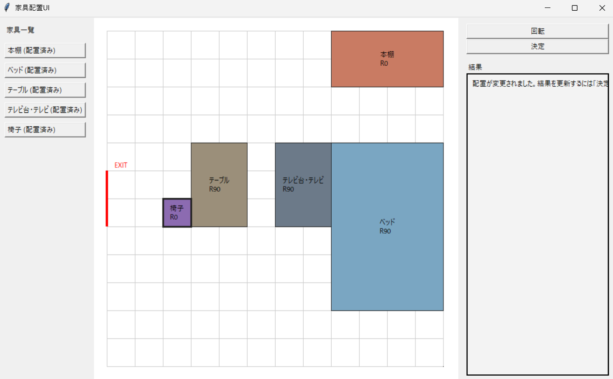

# 家具配置に基づく室内危険度評価システム

## 概要
本システムは、ユーザーが現実の部屋に近い家具配置を入力し、その配置に対する危険度を確認できる家具配置支援システムです。  
家具の位置や向きによって、転倒リスクや避難経路の妨げになりやすさが変わるため、初期配置をユーザー自身が作成できるUIを実装しました。

## 背景
従来の固定レイアウトによる評価では、実際の住環境に合わせた危険度の確認が難しいという課題があります。  
そこで本システムでは、ユーザーが自分の部屋に合わせて家具を配置し、その結果をもとに危険度を評価できるようにしました。

## システムの特徴
- 本棚、ベッド、テーブル、テレビ台・テレビ、椅子を配置可能
- 家具を部屋グリッド上に配置し、移動・回転できる
- 家具の重なりや部屋外への配置は自動で制限
- 全家具を配置した後に「決定」を押すことで危険度を算出
- 危険度の内訳と検出内容を確認可能

## 利用手順
1. 家具一覧から家具を選択する
2. 部屋グリッド上に家具を配置する
3. 必要に応じて回転・再配置する
4. すべての家具を配置する
5. 「決定」を押して危険度を確認する

## 危険度評価
本システムでは、以下のような観点から危険度を評価します。
- 背の高い家具の転倒方向にベッドがある場合
- 出口付近に高い家具があり、避難経路を妨げる場合
- ベッド頭側の近くにテレビ家具がある場合

## 実装構成
- `main.py`: アプリケーション起動
- `layout_ui.py`: 家具配置UI
- `models.py`: 部屋・家具データモデル
- `risk.py`: 危険度計算ロジック

## 今後の展望
- 家具操作UIの改善
- 家具種類の追加
- 部屋条件の可変化
- 評価ルールの拡張
- 結果の可視化強化
